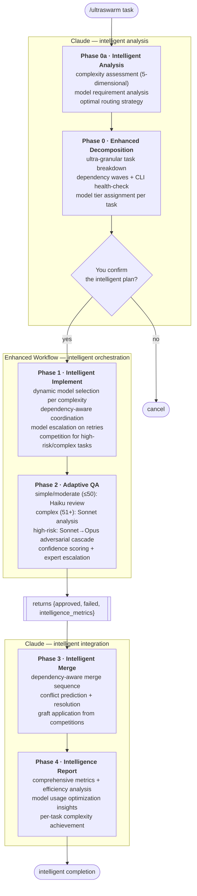
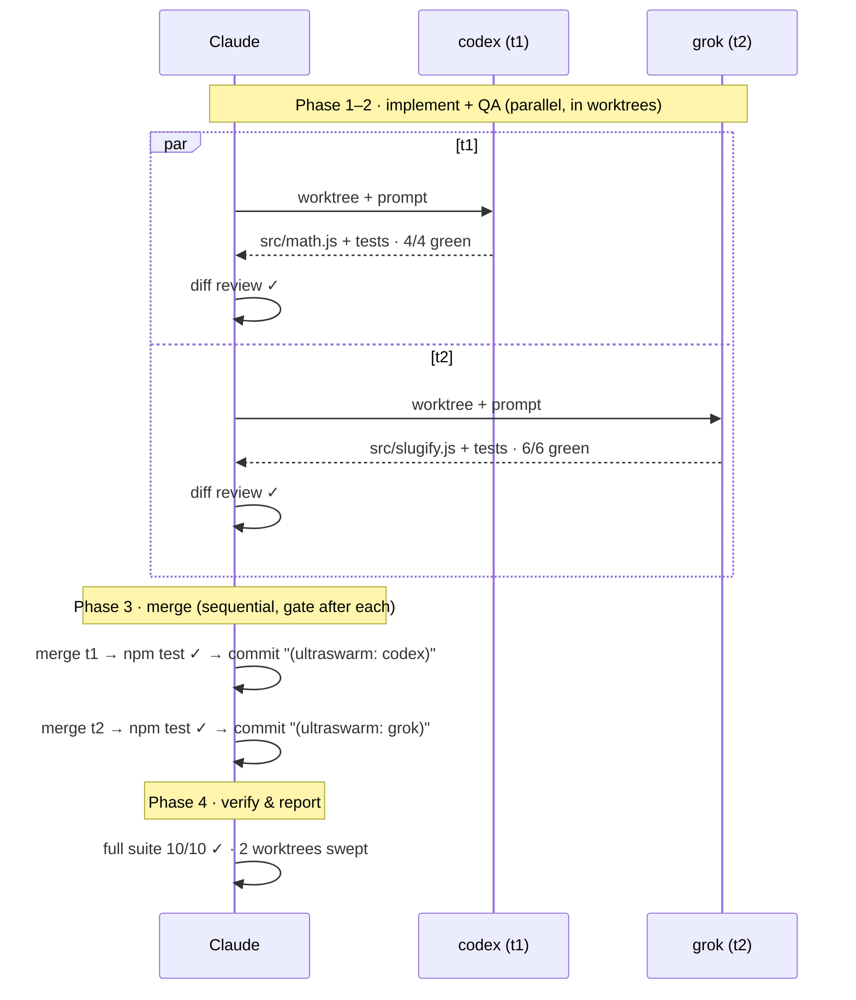

# ultraswarm

**Intelligent orchestration of external AI coding CLIs — complexity-routed models, isolated git worktrees, adversarial QA, Claude-only merge.**

`ultraswarm` orchestrates a swarm of external AI coding CLIs (codex, gemini, grok, agy, droid, opencode). It analyzes your task's complexity, decomposes it into atomic units, routes each to the best CLI *and* the right model tier within that CLI — fast/cheap models for simple work, powerful models for complex work, with automatic escalation when an attempt fails QA — runs them in isolated git worktrees, QA-reviews every diff, and merges only what passes. Dependent tasks run as chained waves, each re-based on the merged result of the wave before it. The orchestrator never writes feature code; it decomposes, reviews, judges, merges, and reports.

**Run it three ways** (same orchestration core, identical behaviour):

- **As a [Claude Code](https://claude.com/claude-code) skill** — `/ultraswarm <task>`. Native Workflow engine with live `/workflows` progress and resume. → [Claude Code installation](#claude-code)
- **As a Codex skill** — `$ultraswarm <task>`. Codex plans and launches the standalone runner. → [Codex installation](#codex)
- **As a standalone CLI** — `node bin/ultraswarm.mjs …`, hosted from Grok or any shell. → [Running from any CLI](#running-from-any-cli-codex--grok--shell)

As of v2.1 the full pipeline is **live-validated end-to-end**: competition + judge panel + 3-lens adversarial QA, model escalation, dependency waves, and resume-from-checkpoint have all been exercised on real multi-task runs (the swarm built this repo's own config validator as its test workload).

**The point**: spend expensive model tokens only where complexity demands them, spend external-CLI tokens on the typing, and spend Claude's judgment on decomposition, review, and merge.

---

## Table of contents

- [How it works](#how-it-works)
- [Why use it](#why-use-it)
- [Prerequisites](#prerequisites)
- [Installation](#installation)
- [Claude Code Usage](#claude-code-usage)
- [Running from any CLI (Codex / Grok / shell)](#running-from-any-cli-codex--grok--shell)
- [Choosing which CLIs to use](#choosing-which-clis-to-use)
- [The worker registry](#the-worker-registry)
- [The QA model](#the-qa-model)
- [What gets created on disk](#what-gets-created-on-disk)
- [Worked example](#worked-example)
- [Configuration reference](#configuration-reference)
- [Troubleshooting](#troubleshooting)
- [Limitations & status](#limitations--status)
- [Repository layout](#repository-layout)

---

## How it works

Six intelligent phases. Claude runs Phases 0a, 0, 3, and 4 with dynamic model selection; Phases 1–2 run inside an enhanced Workflow with intelligent routing.



**The role contract.** External CLIs do *all* feature coding inside throwaway worktrees. Claude decomposes, reviews, judges, merges, and reports — it never writes feature code, with one exception: if every CLI exhausts its attempts on a task, Claude implements that one task directly and flags it loudly in the report.

**Isolation.** Every task attempt runs in its own `git worktree` on its own branch, so a bad CLI run can't corrupt your working tree or another task's work. Nothing touches your real branch until Phase 3 — and only approved, gate-passing diffs, merged one at a time.

**Dependency waves.** Tasks within one Workflow must be mutually independent, because all its worktrees fork the same base SHA. When tasks depend on each other, Phase 0 computes topological *waves* and runs each wave as its own Workflow, re-based on the merged result of the wave before it — so dependents always build on their actual prerequisites. The Workflow script refuses (fail-fast) a task list containing intra-invocation dependency edges, and a failed task blocks its later-wave dependents loudly instead of letting them run blind.

---

## Why use it

### 🧠 **Intelligent Cost Optimization**
External CLIs use precisely-matched models for each task complexity. Simple tasks get fast/cheap models, complex tasks get powerful models, and retries escalate the tier instead of repeating the same mistake at the same capability. Measured in the live validation: routine simple-tier tasks cost ~70–80k Claude orchestration tokens and finish in ~7 minutes; only the tasks that genuinely need the high-risk path pay its ~4–7× premium.

### ⚡ **Ultra-Granular Parallelization**
Advanced task decomposition breaks work into atomic units (≤15/100 complexity each) with dependency analysis. More tasks can run in parallel, reducing wall-clock time and enabling better resource utilization.

### 🎯 **Adaptive Quality Assurance** 
QA depth scales intelligently: Haiku reviews for simple and moderate tasks (≤50 complexity), Sonnet for complex tasks (>50), and a Sonnet→Opus adversarial cascade for high-risk work (the security lens always runs on Opus; correctness/regression escalate only on doubt). Quality is enforced where it matters, efficiency where it doesn't.

### 📊 **Comprehensive Intelligence**
Real-time complexity tracking, model efficiency metrics, parallelization analysis, and cost optimization insights. Full transparency into what models were used, why, and how effectively.

### 🛡️ **Enhanced Reliability**
All the original ultracode guarantees — deterministic phases, schema-validated output, adversarial verification — enhanced with intelligent model escalation, dependency coordination, and expert-tier fallbacks.

### 🔍 **Transparent Failures**
Enhanced failure analysis with complexity reassessment, model tier recommendations, and dependency impact analysis. When something fails, you know exactly why and how to fix it.

**Perfect for**: Complex features requiring mixed skill levels, cost-conscious development workflows, teams wanting maximum automation with full transparency, and any scenario where intelligent resource allocation matters more than raw speed.

---

## Prerequisites

**Common to all run modes:**

- **A git repository.** ultraswarm works exclusively through git worktrees (created under `~/worktrees/` by default).
- **At least two healthy external coding CLIs.** ultraswarm needs ≥2 working CLIs or it stops (it will not silently fall back to the orchestrator coding everything). Install and authenticate the ones you want:

  | CLI | Install (typical) | Auth |
  |---|---|---|
  | [codex](https://github.com/openai/codex) | `npm i -g @openai/codex` | `codex login` |
  | [gemini](https://github.com/google-gemini/gemini-cli) | `npm i -g @google/gemini-cli` | `gemini` (interactive login) |
  | grok | [xAI Grok CLI](https://x.ai/cli) (standalone `grok` binary on `PATH`) | `grok login` (OAuth via auth.x.ai) |
  | agy | [Google Antigravity](https://antigravity.google) CLI (standalone `agy` binary) | Sign in to Antigravity (Google account) |
  | [droid](https://factory.ai/product/cli) | Factory CLI (`droid`) | Sign in to Factory (requires an active subscription) |
  | [opencode](https://opencode.ai/docs/#install) | `npm i -g opencode-ai` (see install docs) | provider key (e.g. xAI) |

  You don't need all six. ultraswarm health-checks and write-probes whatever is installed and routes only to the ones that pass. See [Limitations & status](#limitations--status) for which CLIs are currently verified.

**For the Claude Code skill** (`/ultraswarm`):

- **Claude Code** with the Workflow tool available. → [Installation](#installation)

**For the standalone runner** (`bin/ultraswarm.mjs`, hosted from Codex / Grok / shell — no Claude Code needed):

- **Node ≥20**, and the repo checked out + `npm install`'d (it has deps).
- **A brain** for the QA/decompose reasoning — *either* your local authenticated `claude` CLI (default, **no API key**) *or* `ANTHROPIC_API_KEY` for the Anthropic API.
- → [Running from any CLI](#running-from-any-cli-codex--grok--shell)

---

## Installation

Claude Code and Codex use different skill registries and invocation syntax.
Install the integration for the host you use.

### Claude Code

ultraswarm is packaged as a Claude Code plugin. **Pick one** of the two methods below — don't do both, or the skill will be registered twice.

#### Method A — Plugin (recommended)

The repo is its own single-plugin marketplace. From inside Claude Code:

```
/plugin marketplace add fubak/ultraswarm
/plugin install ultraswarm@ultraswarm
```

That's it — `/ultraswarm` is available after the plugin loads. Update later with `/plugin marketplace update ultraswarm`. This pulls from the repo's default branch, so no manual clone is needed.

#### Method B — Manual symlink (for local development)

Use this if you're hacking on the skill itself and want a live-editable checkout.

```bash
# 1. Clone
git clone https://github.com/fubak/ultraswarm.git ~/projects/ultraswarm

# 2. Symlink the skill into your Claude skills directory
ln -s ~/projects/ultraswarm/skills/ultraswarm ~/.claude/skills/ultraswarm

# 3. Verify
readlink -f ~/.claude/skills/ultraswarm   # → ~/projects/ultraswarm/skills/ultraswarm
head -3 ~/.claude/skills/ultraswarm/SKILL.md
```

The skill registry loads at session start, so `/ultraswarm` becomes available in your **next** Claude Code session. Symlinking (rather than copying) means `git pull` in the repo updates the live skill automatically.

### Codex

Codex discovers user skills from `~/.agents/skills`, not `~/.codex/skills`.
The Codex integration uses the standalone runner, so keep a checkout of the
repository and install its host-specific skill as a live symlink:

```bash
git clone https://github.com/fubak/ultraswarm.git ~/projects/ultraswarm
cd ~/projects/ultraswarm
npm install
bash scripts/install-codex-skill.sh
```

The installer creates:

```text
~/.agents/skills/ultraswarm -> ~/projects/ultraswarm/hosts/codex/skills/ultraswarm
```

Restart Codex after installation, then verify the skill appears in `/skills`.
Invoke it explicitly with `$ultraswarm`; `/ultraswarm` is Claude Code syntax.

For a checkout outside `~/projects/ultraswarm`, the symlink lets the skill find
the runner automatically. Set `ULTRASWARM_HOME=/absolute/path/to/ultraswarm` if
you replace the symlink with a copied skill directory.

---

## Claude Code Usage

From within a git repository, in Claude Code:

```
/ultraswarm <describe the work you want done>
```

Examples:

```
/ultraswarm add a rate limiter to the API, with unit tests, plus a usage doc

/ultraswarm migrate the date helpers from moment to date-fns across the codebase

/ultraswarm build the settings page: form component, validation, and the PATCH endpoint
```

Two other modes:

```
/ultraswarm analyze <task>   # Phase 0a only: complexity assessment + recommended
                             # routing/cost estimate — nothing launches (~free)
/ultraswarm config           # interactive roster + model-tier configuration builder
```

`analyze` is the cheap way to preview what a run would look like before paying for one.

**What happens next:**

1. **Claude decomposes** your request into independent tasks, picks a CLI for each by specialty, classifies each as `routine` or `high` risk, and detects your repo's gate commands (build / test / lint).
2. **Claude shows you the task table and waits for your confirmation.** This is the opt-in gate — nothing runs until you approve. This is your moment to fix routing, split a task, or adjust risk levels.
3. **The swarm runs.** CLIs code in worktrees, QA runs per task, failures retry/reassign automatically. You can watch live with `/workflows`.
4. **Claude merges** approved work into your tree one task at a time, gating after each.
5. **Claude reports**: a per-task table (which CLI, how many attempts, QA verdict, files touched) and a loud list of anything that failed, was reassigned, conflicted, or fell back to Claude.

Your working branch is only ever touched in step 4, and only by approved, gate-passing diffs.

---

## Running from any CLI (Codex / Grok / shell)

You do **not** need Claude Code to run ultraswarm. The standalone runner `bin/ultraswarm.mjs` lets **Codex CLI, Grok CLI, or a bare shell** host the same swarm — same orchestration core, identical behaviour. (The Claude Code `/ultraswarm` skill is the other way to run it; it adds a live `/workflows` UI and native resume, but the pipeline is the same.)

**How it works:** the host agent decomposes the task into a plan (it has repo access), then the runner executes it — waves → implement → adaptive QA → merge → report. The runner brings its own "brain" for the QA/decompose reasoning: by default your local `claude` CLI (no API key — see *Cost & auth*), or the Anthropic API as a fallback.

### Setup (once)

```bash
git clone https://github.com/fubak/ultraswarm.git ~/projects/ultraswarm
cd ~/projects/ultraswarm && npm install      # the runner has deps (ajv, @anthropic-ai/sdk)
```

The runner needs **Node ≥20**, **≥2 authenticated worker CLIs** (codex/gemini/grok/agy/droid/opencode — same roster as the skill), and a **brain** (defaults to your local authenticated `claude` CLI — no API key; see *Cost & auth* below).

### Run it directly (any shell)

```bash
cd <your-git-repo>
# let the runner decompose for you (single-shot, lower fidelity):
node ~/projects/ultraswarm/bin/ultraswarm.mjs --decompose "add a rate limiter with unit tests" --yes
# …or hand it a plan you wrote yourself:
node ~/projects/ultraswarm/bin/ultraswarm.mjs --plan-file plan.json --yes
```

Flags: `--plan-file <json>` (host-supplied plan) · `--decompose "<task>"` (built-in fallback decomposer) · `--yes` (execute; omit to print the plan and stop) · `--resume <id>` (resume a stopped run from its journal under `.ultraswarm/`).

### From Codex

Install the Codex skill once using the [Codex installation](#codex), then run
it from any target git repository:

```text
$ultraswarm add a rate limiter with unit tests
$ultraswarm analyze migrate the date helpers from moment to date-fns
$ultraswarm config
```

For a full run, Codex explores the repository, writes
`.ultraswarm-plan.json`, validates and shows the plan, and waits for approval
before running `--plan-file ... --yes`. It never writes the feature code itself.

`hosts/codex/AGENTS.md` remains as a legacy fallback for environments where
user skills cannot be installed. Do not use both mechanisms in the same target
repository, because they duplicate the host instructions.

### From Grok (or any other agent)

Give Grok the contents of `hosts/grok/ultraswarm.md` as its instructions — same flow: decompose → `.ultraswarm-plan.json` → `--plan-file` → relay. Any agent that can run a shell command can host the runner this way.

**The plan format** is `{"tasks":[{id,description,files,cli,model_tier,complexity_score,risk,dependencies,prompt}]}` (`cli` ∈ codex/gemini/grok/agy/droid/opencode; task `id` limited to `[A-Za-z0-9._-]`). The runner **validates** it — rejecting unknown CLIs, bad tiers, dependency cycles, and unsafe task ids — then runs waves → implement → adaptive QA → merge → report, exactly like the skill.

**Cost & auth (read this):** the standalone runner's QA brain defaults to the **local `claude` CLI** (`claude -p`), so if your machine already has an authenticated Claude Code install, **no API key is needed** — the brain reuses your Claude Code auth and billing, exactly like the `/ultraswarm` path. If `claude` isn't on `PATH`, the runner falls back to the raw **Anthropic API**, which needs `ANTHROPIC_API_KEY` and bills API tokens per call. Force either with `ULTRASWARM_BRAIN=claude-cli` or `ULTRASWARM_BRAIN=anthropic-api`. Either way, each worker CLI still needs its own auth. Claude Code remains the highest-fidelity host (native live UI + resume).

---

## Choosing which CLIs to use

By default the swarm uses every CLI from the [worker registry](#the-worker-registry) that's actually installed and passes a write probe. You can narrow or customize that roster with a small JSON config.

### Interactive builder (easiest)

```
/ultraswarm config
```

Claude probes which CLIs are installed on your machine, shows you the list, asks which to enable (multi-select), and writes the config file for you — global or per-repo, your choice. Re-run it any time to change the roster.

### The config file

Two locations, **project overrides global**:

- **Global default:** `~/.claude/ultraswarm.config.json` — applies to every repo.
- **Per-repo override:** `ultraswarm.config.json` in a repo root — overrides the global file for that project (safe to commit so a team shares one roster).

```json
{
  "enabled": ["codex", "grok", "opencode"],
  "overrides": {
    "codex": { "timeoutMs": 900000 },
    "grok":  { "invocation": "grok --always-approve -m grok-build -p \"$(cat .ultraswarm-prompt.txt)\"" },
    "opencode": {
      "models": {
        "simple":   { "model": "xai/grok-build-0.1", "invocation": "opencode run --agent build -m \"xai/grok-build-0.1\" \"$(cat .ultraswarm-prompt.txt)\"" },
        "moderate": { "model": "xai/grok-4.3",       "invocation": "opencode run --agent build -m \"xai/grok-4.3\" \"$(cat .ultraswarm-prompt.txt)\"" }
      }
    }
  }
}
```

- **`enabled`** — allowlist of registry CLI names the swarm may use. Omit it to mean "all installed CLIs." (An empty list is treated as a mistake, not "disable everything.")
- **`overrides`** — optional per-CLI tweaks merged onto the built-in registry row. Two forms, both supported:
  - **Flat** (one model for all complexity tiers): `invocation`, `timeoutMs`, `specialty`, `alternate`.
  - **Tiered** (`models.{simple|moderate|complex|expert}`): a `{model, invocation}` pair per complexity tier. A `models` block must include at least the `simple` tier — it's the fallback when a tier isn't configured.
- An optional **`intelligence`** block tunes complexity thresholds, task granularity, and which Claude model handles each orchestration phase — see [`ultraswarm.config.advanced.json`](ultraswarm.config.advanced.json) for the full annotated example with model IDs **verified against the real CLIs** (model IDs drift; an invalid ID does *not* fail fast, so the shipped example matters).

Starter templates: [`ultraswarm.config.example.json`](ultraswarm.config.example.json) (minimal) and [`ultraswarm.config.advanced.json`](ultraswarm.config.advanced.json) (full intelligence config). Whatever you enable, Phase 0 still health-checks and write-probes each CLI and drops any that aren't actually working — telling you which and why. The swarm needs **at least two** working CLIs to run. Configs are validated by [`scripts/router.mjs`](scripts/router.mjs)'s `validateConfig` (CI runs it against the shipped example on every push).

---

## The worker registry

Tasks are routed to CLIs by specialty, then to a **model tier within that CLI** by complexity score (simple ≤20 · moderate ≤50 · complex ≤100 · expert >100):

| CLI | Specialty | Model tiers (verified 2026-06-10/11) | Status |
|---|---|---|---|
| **codex** | Backend, logic, algorithms, debugging | gpt-5.4-mini → gpt-5.4 → gpt-5.5 | ✅ live-verified v2.1 e2e (slow, ~5+ min/task) |
| **gemini** | Frontend, UI, CSS, components | gemini-2.5-flash → gemini-2.5-pro | ✅ verified |
| **grok** | Tests, refactors, general | grok-build → grok-composer-2.5-fast | ✅ live-verified v2.1 e2e |
| **agy** | Docs, boilerplate, general | gemini-2.5-flash → gemini-2.5-pro | ✅ verified |
| **droid** | General full-stack implementation, refactoring | claude-haiku-4-5 → claude-opus-4-8 | ✅ enabled (needs a Factory subscription; help-verified) |
| **opencode** | Junior tier: boilerplate, lint/type fixes, simple tests, JSDoc | xai/grok-build-0.1 → xai/grok-4.20-0309-reasoning | ✅ live-verified v2.1 e2e |

**Routing isn't rigid.** For `high`-risk tasks, ultraswarm sends the *same* task to two CLIs in parallel worktrees and a judge panel picks the winner — independent attempts beat one-attempt-and-hope when the task is risky. Routine tasks go to a single CLI, and a failed attempt escalates the model tier before retrying.

**Model IDs drift.** CLIs auto-update and rename models (observed live: grok went 0.2.43→0.2.47 overnight). An invalid model ID does **not** fail fast — codex hangs until the wrapper timeout — so Phase 0 re-verifies configured models each run (`opencode models`, `grok models`, codex's `~/.codex/models_cache.json`) and CI validates the shipped config's structure on every push.

**Health is checked at runtime, every run.** Phase 0 runs `<cli> --version` *and* a write probe (it has the CLI create a trivial file inside a scratch worktree) for each CLI before routing. `--version` proves a CLI is installed; only the write probe proves it can actually write inside a worktree. Any CLI that fails is dropped from routing and reported to you. If fewer than two survive, the run stops.

The canonical, always-current registry lives in [`skills/ultraswarm/SKILL.md`](skills/ultraswarm/SKILL.md); the verified invocation strings and per-CLI quirks are in [`docs/notes/cli-verification.md`](docs/notes/cli-verification.md).

---

## The QA model

QA depth is **adaptive** — it scales with both risk and complexity, so trivial tasks aren't over-verified and risky ones aren't under-verified.

**Routine tasks:**
- Mechanical gates (build / typecheck / test / lint) run inside the worktree.
- One Claude review agent reads the diff — Haiku for simple and moderate tasks (complexity ≤50), Sonnet for complex tasks (>50) — and checks: acceptance criteria actually met, conventions followed, no scope creep, no silently swallowed errors, tests verify intent rather than hardcoded outputs. A reviewer that flags `requires_expert_review` escalates the diff to an Opus second pass.

**High-risk tasks** (anything touching auth/security/payments, shared interfaces or data models, architectural changes, or logic with no existing test coverage — plus any task scoring >70 complexity):
- Two CLIs implement the *same* task in parallel worktrees; a Sonnet **judge panel** scores correctness / model efficiency / complexity handling and the winner advances.
- The winner faces a **3-lens adversarial verify** — *correctness*, *security* (secret/injection/authz/leak checks), and *regression* lenses, each prompted to **refute** the work with explicit verdict-polarity rules. The lenses run as a cost-aware cascade: the **security** lens always runs on **Opus** (asymmetric risk), while *correctness* and *regression* run on **Sonnet** first and escalate to **Opus** only when they refute or return borderline confidence. Approval requires a hard **quorum of ≥2 lens votes**, a confidence-weighted score ≥60, and **zero critical refutations** — a single `severity: critical` finding fails the task no matter how confident the other lenses are. (With `intelligence.maxIntelligence` enabled, the Opus ceiling becomes Fable.)

**When QA rejects:** the task retries on the *same* CLI with the reviewer's concrete feedback appended **and the model tier escalated** (simple→moderate→complex→expert), so the next attempt is both better-informed and better-equipped. If it exhausts retries, it reassigns to an alternate CLI carrying the accumulated feedback *and* the escalated tier. If every path is exhausted, the task tombstones as failed — and Claude either implements it directly (flagged) or reports it, never silently drops it.

This is not theoretical: in the v2.1 live validation the adversarial lenses caught a `validateConfig` crash, an `NaN` complexity score silently routing to the most expensive tier, and a documented-config-form that was being silently ignored — all in code that had already passed its mechanical gates.

---

## What gets created on disk

| Location | What | Lifetime |
|---|---|---|
| `~/worktrees/<repo>-us-<taskid>-<cli>/` | One linked git worktree per task attempt | Removed in the Phase 3 cleanup sweep, after the report |
| `<worktree>/.ultraswarm-prompt.txt` | The self-contained prompt handed to the CLI | Deleted by the wrapper before it commits (never lands in a diff) |
| branches `ultraswarm/<taskid>-<cli>` | One branch per worktree | Deleted in the cleanup sweep |
| your working branch | Approved, merged, gate-passing commits | Permanent — this is the output |

Worktrees and branches are deliberately kept until *after* the final report, so you can inspect any task's diff — including failed ones — before they're swept.

---

## Worked example

Asking `/ultraswarm` to build two small utilities with tests — a routine, two-task run. This is the actual shape of the project's end-to-end smoke test.

**Phase 0 — decompose & confirm**

```
health check:  codex ✓   grok ✓   (only these two needed for a 2-task run)
base gates:    npm test ✓ on a clean tree
plan:          t1  [routine]  codex → src/math.js     + test/math.test.js
               t2  [routine]  grok  → src/slugify.js  + test/slugify.test.js
→ you approve
```

**Phases 1–4 — the two tasks flow through in parallel**



**Final report**

| task | cli | attempts | QA | files |
|---|---|---|---|---|
| t1 | codex | 1 | ✓ | `src/math.js`, `test/math.test.js` |
| t2 | grok | 1 | ✓ | `src/slugify.js`, `test/slugify.test.js` |

Nothing failed · nothing reassigned · nothing fell back to Claude.

```
Token accounting (this run, best-effort)
  Claude — orchestration + QA:   ~48k tokens (+ inline orchestration)
  External CLIs — coding:        ~140k tokens  (offloaded; provider tokens, not Claude)
  Est. Claude work offloaded:    ~140k         † proxy estimate, not a measured Claude-token figure
```

The report ends with a **token-accounting** block: the Claude tokens the run actually cost you (orchestration + QA) vs. the external-CLI tokens that did the coding. The "offloaded" figure is a transparent **proxy estimate** — it counts what the CLIs self-reported (so the real number may be higher) and external tokens aren't Claude-token-equivalent. It shows *where the work went*, not a billing-exact "tokens saved."

---

## Configuration reference

To choose *which* CLIs the swarm uses, see [Choosing which CLIs to use](#choosing-which-clis-to-use) — that's the config most users want. The reference below is the internal per-run **Workflow** input, which Claude authors from the `SKILL.md` template and fills in from Phase 0 (your `ultraswarm.config.json` feeds the `registry`, `alternates`, and `timeouts` fields and Phase 0 routing). You don't normally set these by hand, but it helps to know the knobs:

| Field | Meaning |
|---|---|
| `repo` / `repoName` | Absolute path and short name of the target repo |
| `baseBranch` | Branch/SHA worktrees fork from and all QA diffs review against — for wave N+1 this is the post-merge HEAD of wave N |
| `worktreeRoot` | Absolute path for worktrees (default `~/worktrees`, expanded — never a literal `~`) |
| `gates` | List of `{name, cmd}` — build/test/lint commands run in each worktree and after each merge |
| `registry` | Map of CLI → invocation string (single-model) **or** map of tier → invocation string (multi-model) |
| `alternates` | Map of CLI → fallback CLI for the reassign step |
| `timeoutMs` | Default wall-clock budget before a run counts as a failed attempt |
| `timeouts` | Optional per-CLI (or per-`cli-tier`) budget overrides; falls back to `timeoutMs` |
| `intelligence` | `maxComplexityPerTask`, `adaptiveQA` and friends — tunes decomposition and QA depth |
| `tasks` | The decomposed task list for **this wave** — must be mutually independent (the script throws on intra-invocation dependency edges) |
| `taskGraph` | Optional `independent_clusters` grouping within the wave |

---

## Troubleshooting

**"Fewer than 2 CLIs are healthy" — the run stops.**
Install/authenticate more CLIs. Check each manually: `<cli> --version`, then confirm it can write a file unattended in a throwaway `git init` repo. A CLI that needs interactive approval or login won't work as a worker.

**A CLI passes `--version` but every task it gets fails.**
This is exactly why the write probe exists. Some sandboxed CLIs reject all file writes inside *linked git worktrees* even though they run fine in a normal repo (codex did this until its registry invocation gained `-s workspace-write`). ultraswarm drops these in Phase 0; if you see it happen, that CLI needs a sandbox/config fix before it can be a worker.

**Standalone runner: a worker reports `worker <cli> failed (auth)` or `(transport)`.**
Some worker CLIs (notably `grok` under a TUI host) die immediately when launched from a *linked worktree* with `Auth(AuthorizationRequired)` or transport/MCP/DNS errors, even though they work interactively. The runner classifies these so the report says e.g. `worker grok failed (auth) — run \`grok login\``. Fixes: authenticate the CLI in a plain shell first (`<cli> login`), prefer worker CLIs that run headlessly from worktrees (codex with `-s workspace-write`, opencode), or pin a known-good invocation in `overrides`. High-risk tasks already fall back to an alternate CLI; for routine tasks, swap the task's `cli` to a working one.

**A task hangs for its entire timeout and produces nothing.**
Check the model ID in your config. An invalid model name does **not** fail fast — codex in particular hangs until the wrapper kills it. Run the CLI's model listing (`opencode models`, `grok models`) and compare against your `overrides`; `validateConfig` in `scripts/router.mjs` catches structural problems but cannot know whether a well-formed ID actually exists on your account.

**Every task tombstones immediately.**
Almost always a **broken gate**. If your build/test/lint command errors on the *base tree* (before any changes), every worker looks like it failed QA no matter what it wrote. Phase 0 verifies gates green on the base tree first for this reason — but if you bypass that, check the gate command runs clean on a fresh checkout.

**Merge conflicts.**
Claude resolves them by picking one source of truth (never blending), and documents the choice in the report. If two tasks both needed to edit the same file, that's a decomposition smell — they should have been one task.

**Leftover worktrees in `~/worktrees/`.**
The cleanup sweep runs after the report. If a run was interrupted, clean up manually:
```bash
cd <your-repo>
git worktree list                       # find <repo>-us-* entries
git worktree remove --force <path>
git branch --list 'ultraswarm/*' | xargs -r git branch -D
```

---

## Limitations & status

Honest current state. The orchestration pipeline was live-validated end-to-end on **v2.1** (2026-06-10/11); **v2.2–v2.3** added the behavior-test harness and the Claude-model token optimization (real per-phase routing + the adversarial-QA cascade); **v2.4** added the **standalone host runner** (`bin/` + `lib/`, with a `claude -p` brain so it needs no API key — see [Running from any CLI](#running-from-any-cli-codex--grok--shell)). Current plugin version: **2.4.0**.

- **Live-validated end-to-end (v2.1):** a real multi-task run built this repo's own model-router module (`scripts/router.mjs` + tests + CI wiring): high-risk **competition → Sonnet judge panel → 3-lens adversarial QA** (since v2.3 a cost-aware cascade: security on Opus, correctness/regression on Sonnet escalating to Opus on doubt) with feedback retries and **model escalation** (gpt-5.4→gpt-5.5), routine simple-tier tasks approved first attempt, **dependency-wave chaining** with per-wave merges, and **resume-from-checkpoint** recovering a stopped run mid-flight with zero re-spent external tokens. A follow-up single-task run on the installed plugin validated the routine path catching real escaping bugs in review.
  - **codex** needs specific flags — `codex exec -s workspace-write --skip-git-repo-check '<prompt>' </dev/null` — because its default sandbox rejects worktree writes and bare `exec` hangs on stdin. It's also **slow (~5+ min/task)**, so it runs with a 15-min timeout. The registry encodes all of this.
- **Enabled but not smoke-tested here:** **droid** — requires an active Factory subscription. The test machine had no plan, so `droid exec` returned 0 turns / 0 tokens (consistent with no model access, not a CLI defect). On a subscribed machine, Phase 0's write probe verifies it before routing. All four tier model IDs (`claude-haiku-4-5` → `claude-sonnet-4-6` → `claude-opus-4-8`) are in the registry; the test machine just couldn't exercise them without a Factory plan.
- **Token capture is partial.** Only **codex** (and droid in JSON mode) reliably emit a parseable token count; grok reports intermittently; gemini/opencode/agy report none. The report shows a `captured/total` coverage fraction and treats the external-token figure as an undercount, never a precise "tokens saved."
- **Cost calibration (measured):** a routine task that passes first attempt costs roughly **70–80k Claude tokens** of orchestration + QA; one QA-rejection retry roughly doubles that; the high-risk competition path runs **~250–550k**. Budget 2–3× the first-attempt figure whenever a rejection is plausible.
- **Local only** — no remote/CI execution of the swarm itself. Everything runs in local worktrees. (The repo's *validator* runs in CI; the swarm does not.)

CLI availability, flags, and **model IDs** drift over time (observed live: grok auto-updated mid-testing). The skill re-checks health, write capability, and configured models at the start of *every* run, so a CLI that breaks (or gets fixed) is picked up automatically — the table above is a snapshot, not a hard dependency.

---

## Repository layout

```
ultraswarm/
├── README.md                                   ← you are here
├── CHANGELOG.md                                ← release history
├── LICENSE                                     ← MIT
├── package.json · package-lock.json            ← deps for the standalone runner (ajv, @anthropic-ai/sdk)
├── ultraswarm.config.example.json              ← starter CLI-selection config (minimal)
├── ultraswarm.config.advanced.json             ← full intelligence config, verified model IDs
├── skills/ultraswarm/SKILL.md                  ← Claude Code skill (native Workflow orchestrator)
├── bin/
│   └── ultraswarm.mjs                          ← standalone runner CLI (--plan-file / --decompose / --resume)
├── lib/                                         ← standalone runner internals (shares the pure core with the skill)
│   ├── engine.mjs                              ← Node Workflow primitives (parallel / pipeline / limiter)
│   ├── validate.mjs · plan-schema.mjs          ← ajv validation + the host→runner plan contract
│   ├── prompts.mjs                             ← shared QA prompt templates + schemas (lifted from SKILL.md)
│   ├── journal.mjs                             ← run journal backing --resume
│   ├── llm/{client,anthropic,claude-cli,brain-router}.mjs   ← brain adapters (claude -p default, API fallback)
│   └── orchestrator/{waves,implement,merge,report,runner,core,decompose}.mjs
├── hosts/
│   ├── codex/
│   │   ├── skills/ultraswarm/SKILL.md          ← Codex user skill ($ultraswarm)
│   │   └── AGENTS.md                           ← legacy Codex launcher fallback
│   └── grok/ultraswarm.md                      ← Grok launcher
├── fixtures/fake-cli.mjs                        ← test fixture: a fake worker CLI
├── scripts/
│   ├── install-codex-skill.sh                  ← symlinks Codex skill into ~/.agents/skills
│   ├── validate.sh                             ← release validator (supports --json)
│   ├── router.mjs                              ← model router: loadConfig / validateConfig / resolveRoute
│   ├── router.test.mjs                         ← 18-case node:test suite for the router
│   ├── workflow-harness.test.mjs               ← behavior tests for the embedded Workflow JS
│   └── smoke-brain.mjs                          ← key-gated Anthropic-API smoke check
├── .github/workflows/validate.yml              ← CI: npm ci + validate.sh on every push/PR
├── .claude-plugin/
│   ├── plugin.json                             ← plugin manifest
│   └── marketplace.json                        ← single-plugin marketplace listing
└── docs/
    ├── specs/2026-06-07-ultraswarm-design.md            ← original design spec
    ├── specs/2026-06-12-portable-host-runner-design.md  ← standalone runner design
    ├── plans/                                  ← implementation plans (historical)
    └── notes/cli-verification.md               ← verified CLI invocations, quirks, e2e findings
```

> `router.mjs`, its tests, and the validate.sh wiring were **built by the swarm itself** during the v2.1 live validation — the test workload doubled as the repo's own tooling. The behavior harness (check [11]) tests the orchestration logic in the skill's embedded Workflow JS on every push, so QA-gate regressions break CI before they can burn tokens in a live run.

> Note: the implementation plan's embedded skill template is intentionally **historical** — it predates the fixes made during review and the end-to-end test. `skills/ultraswarm/SKILL.md` is canonical for Claude Code; `hosts/codex/skills/ultraswarm/SKILL.md` is canonical for Codex.

---

## License

[MIT](LICENSE).
