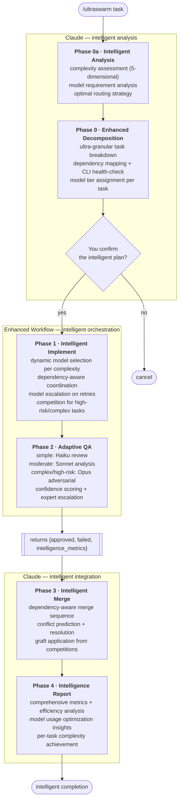
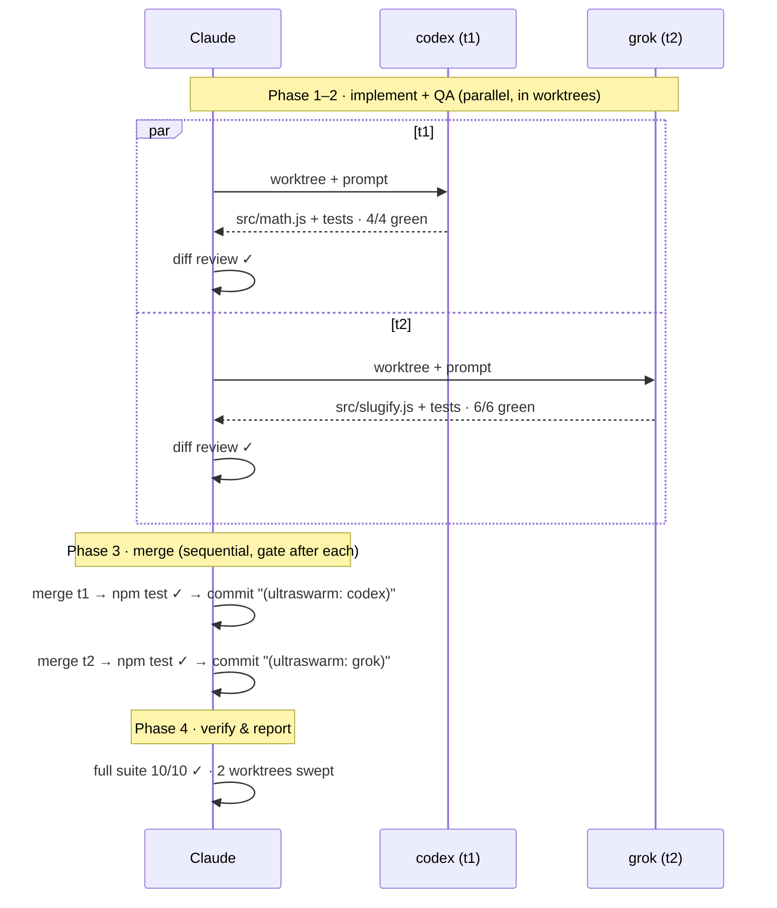

# ultraswarm v2.0

**Advanced AI orchestration with intelligent prompt analysis, dynamic model routing, and ultra-granular task decomposition.**

`ultraswarm` is a [Claude Code](https://claude.com/claude-code) plugin that revolutionizes multi-agent development workflows. Version 2.0 introduces sophisticated intelligence capabilities: automatic complexity assessment, dynamic model selection per task difficulty, and ultra-granular task decomposition that maximizes parallelization while minimizing token usage.

The system intelligently routes work to optimal model tiers across multiple external CLIs (codex, gemini, grok, agy, droid, opencode), automatically escalates models on retry attempts, and provides comprehensive intelligence reporting. Claude provides intelligent orchestration and quality assurance while external CLIs handle the bulk coding using precisely-matched model capabilities.

**Key Innovation**: Spend expensive model tokens only where complexity demands it, use efficient models for simple tasks, and let intelligence routing optimize the entire workflow automatically.

---

## Table of contents

- [How it works](#how-it-works)
- [Why use it](#why-use-it)
- [Prerequisites](#prerequisites)
- [Installation](#installation)
- [Usage](#usage)
- [Choosing which CLIs to use](#choosing-which-clis-to-use)
- [The worker registry](#the-worker-registry)
- [The QA model](#the-qa-model)
- [What gets created on disk](#what-gets-created-on-disk)
- [Worked example](#worked-example)
- [Configuration reference](#configuration-reference)
- [Troubleshooting](#troubleshooting)
- [Limitations & status](#limitations--status)
- [Repository layout](#repository-layout)

---

## How it works

Six intelligent phases. Claude runs Phases 0a, 0, 3, and 4 with dynamic model selection; Phases 1–2 run inside an enhanced Workflow with intelligent routing.



**The role contract.** External CLIs do *all* feature coding inside throwaway worktrees. Claude decomposes, reviews, judges, merges, and reports — it never writes feature code, with one exception: if every CLI exhausts its attempts on a task, Claude implements that one task directly and flags it loudly in the report.

**Isolation.** Every task attempt runs in its own `git worktree` on its own branch, so a bad CLI run can't corrupt your working tree or another task's work. Nothing touches your real branch until Phase 3 — and only approved, gate-passing diffs, merged one at a time.

---

## Why use it

### 🧠 **Intelligent Cost Optimization**
External CLIs use precisely-matched models for each task complexity. Simple tasks get fast/cheap models, complex tasks get powerful models. Intelligence routing can reduce token costs by 40-70% vs. uniform high-tier models while maintaining quality.

### ⚡ **Ultra-Granular Parallelization**
Advanced task decomposition breaks work into atomic units (≤15/100 complexity each) with dependency analysis. More tasks can run in parallel, reducing wall-clock time and enabling better resource utilization.

### 🎯 **Adaptive Quality Assurance** 
QA depth scales intelligently: Haiku reviews for simple tasks, Sonnet for moderate complexity, Opus adversarial analysis for high-risk work. Quality is enforced where it matters, efficiency where it doesn't.

### 📊 **Comprehensive Intelligence**
Real-time complexity tracking, model efficiency metrics, parallelization analysis, and cost optimization insights. Full transparency into what models were used, why, and how effectively.

### 🛡️ **Enhanced Reliability**
All the original ultracode guarantees — deterministic phases, schema-validated output, adversarial verification — enhanced with intelligent model escalation, dependency coordination, and expert-tier fallbacks.

### 🔍 **Transparent Failures**
Enhanced failure analysis with complexity reassessment, model tier recommendations, and dependency impact analysis. When something fails, you know exactly why and how to fix it.

**Perfect for**: Complex features requiring mixed skill levels, cost-conscious development workflows, teams wanting maximum automation with full transparency, and any scenario where intelligent resource allocation matters more than raw speed.

---

## Prerequisites

- **Claude Code** with the Workflow tool available (this is what powers `ultracode`).
- **A git repository.** ultraswarm works exclusively through git worktrees. Worktrees are created under `~/worktrees/` by default.
- **At least two healthy external coding CLIs.** ultraswarm needs ≥2 working CLIs or it stops (it will not silently fall back to Claude coding everything). Install and authenticate the ones you want:

  | CLI | Install (typical) | Auth |
  |---|---|---|
  | [codex](https://github.com/openai/codex) | `npm i -g @openai/codex` | `codex login` |
  | [gemini](https://github.com/google-gemini/gemini-cli) | `npm i -g @google/gemini-cli` | `gemini` (interactive login) |
  | grok | [xAI Grok CLI](https://x.ai/cli) (standalone `grok` binary on `PATH`) | `grok login` (OAuth via auth.x.ai) |
  | agy | [Google Antigravity](https://antigravity.google) CLI (standalone `agy` binary) | Sign in to Antigravity (Google account) |
  | [droid](https://factory.ai/product/cli) | Factory CLI (`droid`) | Sign in to Factory (requires an active subscription) |
  | [opencode](https://opencode.ai/docs/#install) | `npm i -g opencode-ai` (see install docs) | provider key (e.g. xAI) |

  You don't need all six. The skill health-checks and write-probes whatever is installed and routes only to the ones that pass. See [Limitations & status](#limitations--status) for which CLIs are currently verified.

---

## Installation

ultraswarm is packaged as a Claude Code plugin. **Pick one** of the two methods below — don't do both, or the skill will be registered twice.

### Method A — Plugin (recommended)

The repo is its own single-plugin marketplace. From inside Claude Code:

```
/plugin marketplace add fubak/ultraswarm
/plugin install ultraswarm@ultraswarm
```

That's it — `/ultraswarm` is available after the plugin loads. Update later with `/plugin marketplace update ultraswarm`. This pulls from the repo's default branch, so no manual clone is needed.

### Method B — Manual symlink (for local development)

Use this if you're hacking on the skill itself and want a live-editable checkout.

```bash
# 1. Clone
git clone https://github.com/fubak/ultraswarm.git ~/projects/ultraswarm

# 2. Symlink the skill into your Claude skills directory
ln -s ~/projects/ultraswarm/skills/ultraswarm ~/.claude/skills/ultraswarm

# 3. Verify
readlink -f ~/.claude/skills/ultraswarm   # → ~/projects/ultraswarm/skills/ultraswarm
head -3 ~/.claude/skills/ultraswarm/SKILL.md
```

The skill registry loads at session start, so `/ultraswarm` becomes available in your **next** Claude Code session. Symlinking (rather than copying) means `git pull` in the repo updates the live skill automatically.

---

## Usage

From within a git repository, in Claude Code:

```
/ultraswarm <describe the work you want done>
```

Examples:

```
/ultraswarm add a rate limiter to the API, with unit tests, plus a usage doc

/ultraswarm migrate the date helpers from moment to date-fns across the codebase

/ultraswarm build the settings page: form component, validation, and the PATCH endpoint
```

**What happens next:**

1. **Claude decomposes** your request into independent tasks, picks a CLI for each by specialty, classifies each as `routine` or `high` risk, and detects your repo's gate commands (build / test / lint).
2. **Claude shows you the task table and waits for your confirmation.** This is the opt-in gate — nothing runs until you approve. This is your moment to fix routing, split a task, or adjust risk levels.
3. **The swarm runs.** CLIs code in worktrees, QA runs per task, failures retry/reassign automatically. You can watch live with `/workflows`.
4. **Claude merges** approved work into your tree one task at a time, gating after each.
5. **Claude reports**: a per-task table (which CLI, how many attempts, QA verdict, files touched) and a loud list of anything that failed, was reassigned, conflicted, or fell back to Claude.

Your working branch is only ever touched in step 4, and only by approved, gate-passing diffs.

---

## Choosing which CLIs to use

By default the swarm uses every CLI from the [worker registry](#the-worker-registry) that's actually installed and passes a write probe. You can narrow or customize that roster with a small JSON config.

### Interactive builder (easiest)

```
/ultraswarm config
```

Claude probes which CLIs are installed on your machine, shows you the list, asks which to enable (multi-select), and writes the config file for you — global or per-repo, your choice. Re-run it any time to change the roster.

### The config file

Two locations, **project overrides global**:

- **Global default:** `~/.claude/ultraswarm.config.json` — applies to every repo.
- **Per-repo override:** `ultraswarm.config.json` in a repo root — overrides the global file for that project (safe to commit so a team shares one roster).

```json
{
  "enabled": ["codex", "grok", "agy"],
  "overrides": {
    "codex": { "timeoutMs": 900000 },
    "opencode": { "invocation": "opencode run --agent build -m \"xai/grok-4.3\" \"$(cat .ultraswarm-prompt.txt)\"" }
  }
}
```

- **`enabled`** — allowlist of registry CLI names the swarm may use. Omit it to mean "all installed CLIs." (An empty list is treated as a mistake, not "disable everything.")
- **`overrides`** — optional per-CLI tweaks merged onto the built-in registry row: `invocation`, `timeoutMs`, `specialty`, `alternate`.

A starter template is in [`ultraswarm.config.example.json`](ultraswarm.config.example.json). Whatever you enable, Phase 0 still health-checks and write-probes each CLI and drops any that aren't actually working — telling you which and why. The swarm needs **at least two** working CLIs to run.

---

## The worker registry

Tasks are routed to CLIs by specialty:

| CLI | Specialty | Status |
|---|---|---|
| **codex** | Backend, logic, algorithms, debugging | ✅ verified end-to-end (slow, ~5 min/task) |
| **gemini** | Frontend, UI, CSS, components | ✅ verified |
| **grok** | Tests, refactors, general | ✅ verified end-to-end |
| **agy** | Docs, boilerplate, general | ✅ verified end-to-end |
| **droid** | General full-stack implementation, refactoring | ✅ enabled (needs a Factory subscription; help-verified) |
| **opencode** | Junior tier: boilerplate, lint/type fixes, simple tests, JSDoc | ✅ verified |

**Routing isn't rigid.** For `high`-risk tasks, ultraswarm sends the *same* task to two CLIs in parallel worktrees and a judge panel picks the winner — independent attempts beat one-attempt-and-hope when the task is risky. Routine tasks go to a single CLI.

**Health is checked at runtime, every run.** Phase 0 runs `<cli> --version` *and* a write probe (it has the CLI create a trivial file inside a scratch worktree) for each CLI before routing. `--version` proves a CLI is installed; only the write probe proves it can actually write inside a worktree. Any CLI that fails is dropped from routing and reported to you. If fewer than two survive, the run stops.

The canonical, always-current registry lives in [`skills/ultraswarm/SKILL.md`](skills/ultraswarm/SKILL.md); the verified invocation strings and per-CLI quirks are in [`docs/notes/cli-verification.md`](docs/notes/cli-verification.md).

---

## The QA model

QA depth is **tiered by risk** so trivial tasks aren't over-verified and risky ones aren't under-verified.

**Routine tasks:**
- Mechanical gates (build / typecheck / test / lint) run inside the worktree.
- One Claude review agent reads the diff and checks: acceptance criteria actually met, conventions followed, no scope creep, no silently swallowed errors, tests verify intent rather than hardcoded outputs.

**High-risk tasks** (anything touching auth/security/payments, shared interfaces or data models, architectural changes, or logic with no existing test coverage):
- The two competing implementations go to a **judge panel** that scores correctness / simplicity / convention-fit; the winner advances.
- The winner faces a **3-lens adversarial verify** — a *correctness* lens, a *security* lens (the standard secret/injection/authz/leak checks), and a *regression* lens — each prompted to **refute** the work. It needs a 2-of-3 majority to pass.

**When QA rejects:** the task retries on the *same* CLI with the reviewer's concrete feedback appended (so the next attempt knows exactly what to fix). If it exhausts retries, it reassigns to an alternate CLI carrying the accumulated feedback. If every path is exhausted, the task tombstones as failed — and Claude either implements it directly (flagged) or reports it, never silently drops it.

---

## What gets created on disk

| Location | What | Lifetime |
|---|---|---|
| `~/worktrees/<repo>-us-<taskid>-<cli>/` | One linked git worktree per task attempt | Removed in the Phase 3 cleanup sweep, after the report |
| `<worktree>/.ultraswarm-prompt.txt` | The self-contained prompt handed to the CLI | Deleted by the wrapper before it commits (never lands in a diff) |
| branches `ultraswarm/<taskid>-<cli>` | One branch per worktree | Deleted in the cleanup sweep |
| your working branch | Approved, merged, gate-passing commits | Permanent — this is the output |

Worktrees and branches are deliberately kept until *after* the final report, so you can inspect any task's diff — including failed ones — before they're swept.

---

## Worked example

Asking `/ultraswarm` to build two small utilities with tests — a routine, two-task run. This is the actual shape of the project's end-to-end smoke test.

**Phase 0 — decompose & confirm**

```
health check:  codex ✓   grok ✓   (only these two needed for a 2-task run)
base gates:    npm test ✓ on a clean tree
plan:          t1  [routine]  codex → src/math.js     + test/math.test.js
               t2  [routine]  grok  → src/slugify.js  + test/slugify.test.js
→ you approve
```

**Phases 1–4 — the two tasks flow through in parallel**



**Final report**

| task | cli | attempts | QA | files |
|---|---|---|---|---|
| t1 | codex | 1 | ✓ | `src/math.js`, `test/math.test.js` |
| t2 | grok | 1 | ✓ | `src/slugify.js`, `test/slugify.test.js` |

Nothing failed · nothing reassigned · nothing fell back to Claude.

```
Token accounting (this run, best-effort)
  Claude — orchestration + QA:   ~48k tokens (+ inline orchestration)
  External CLIs — coding:        ~140k tokens  (offloaded; provider tokens, not Claude)
  Est. Claude work offloaded:    ~140k         † proxy estimate, not a measured Claude-token figure
```

The report ends with a **token-accounting** block: the Claude tokens the run actually cost you (orchestration + QA) vs. the external-CLI tokens that did the coding. The "offloaded" figure is a transparent **proxy estimate** — it counts what the CLIs self-reported (so the real number may be higher) and external tokens aren't Claude-token-equivalent. It shows *where the work went*, not a billing-exact "tokens saved."

---

## Configuration reference

To choose *which* CLIs the swarm uses, see [Choosing which CLIs to use](#choosing-which-clis-to-use) — that's the config most users want. The reference below is the internal per-run **Workflow** input, which Claude authors from the `SKILL.md` template and fills in from Phase 0 (your `ultraswarm.config.json` feeds the `registry`, `alternates`, and `timeouts` fields and Phase 0 routing). You don't normally set these by hand, but it helps to know the knobs:

| Field | Meaning |
|---|---|
| `repo` / `repoName` | Absolute path and short name of the target repo |
| `baseBranch` | Branch/SHA worktrees fork from and all QA diffs review against (captured in Phase 0) |
| `worktreeRoot` | Absolute path for worktrees (default `~/worktrees`, expanded — never a literal `~`) |
| `gates` | List of `{name, cmd}` — build/test/lint commands run in each worktree and after each merge |
| `registry` | Map of CLI → verified invocation string |
| `alternates` | Map of CLI → fallback CLI for the reassign step |
| `timeoutMs` | Default wall-clock budget before a run counts as a failed attempt |
| `timeouts` | Optional per-CLI budget overrides (e.g. codex needs 15 min); falls back to `timeoutMs` |
| `tasks` | The decomposed task list |

---

## Troubleshooting

**"Fewer than 2 CLIs are healthy" — the run stops.**
Install/authenticate more CLIs. Check each manually: `<cli> --version`, then confirm it can write a file unattended in a throwaway `git init` repo. A CLI that needs interactive approval or login won't work as a worker.

**A CLI passes `--version` but every task it gets fails.**
This is exactly why the write probe exists. Some sandboxed CLIs reject all file writes inside *linked git worktrees* even though they run fine in a normal repo (this is the current codex situation — see below). ultraswarm drops these in Phase 0; if you see it happen, that CLI needs a sandbox/config fix before it can be a worker.

**Every task tombstones immediately.**
Almost always a **broken gate**. If your build/test/lint command errors on the *base tree* (before any changes), every worker looks like it failed QA no matter what it wrote. Phase 0 verifies gates green on the base tree first for this reason — but if you bypass that, check the gate command runs clean on a fresh checkout.

**Merge conflicts.**
Claude resolves them by picking one source of truth (never blending), and documents the choice in the report. If two tasks both needed to edit the same file, that's a decomposition smell — they should have been one task.

**Leftover worktrees in `~/worktrees/`.**
The cleanup sweep runs after the report. If a run was interrupted, clean up manually:
```bash
cd <your-repo>
git worktree list                       # find <repo>-us-* entries
git worktree remove --force <path>
git branch --list 'ultraswarm/*' | xargs -r git branch -D
```

---

## Limitations & status

Honest current state (verified 2026-06-07, re-verified 2026-06-08):

- **Verified end-to-end:** the routine-tier pipeline (decompose → worktree → CLI codes → gates → review → sequential merge → final verify) using **codex**, **grok**, **agy**, **gemini**, and **opencode**. Each implemented its task correctly on the first attempt; merges gated clean; cleanup verified.
  - **codex** needs specific flags — `codex exec -s workspace-write --skip-git-repo-check '<prompt>' </dev/null` — because its default sandbox rejects worktree writes and bare `exec` hangs on stdin. It's also **slow (~5 min/task)**, so it runs with a 15-min timeout. The registry encodes all of this.
- **The high-risk competition path** (competition → judge panel → 3-lens adversarial verify) is **validated live** (2026-06-08): a security-sensitive signed-token task ran codex vs grok through all stages — judge picked the winner, 3 lenses passed, merged green, no defects. Write-up in `docs/notes/highrisk-e2e-2026-06-08.md`.
- **Enabled but not smoke-tested here:** **droid** — uses `droid exec "<prompt>"` and requires an active Factory subscription. The test machine had no plan, so `droid exec` returned 0 turns / 0 tokens (consistent with no model access, not a CLI defect). On a subscribed machine, Phase 0's write probe verifies it before routing.
- **Token capture is partial.** The per-run token metric is best-effort: as of 2026-06-08 only **codex** (and droid in JSON mode) emit a parseable token count — grok/gemini/opencode/agy report none. The report shows a `captured/total` coverage fraction and treats the external-token figure as an undercount, never a precise "tokens saved."
- **Local only** — no remote/CI execution. Everything runs in local worktrees.

CLI availability and flags drift over time. The skill re-checks health and write capability at the start of *every* run, so a CLI that breaks (or gets fixed) is picked up automatically — the table above is a snapshot, not a hard dependency.

---

## Repository layout

```
ultraswarm/
├── README.md                                   ← you are here
├── CHANGELOG.md                                ← release history
├── LICENSE                                      ← MIT
├── ultraswarm.config.example.json              ← starter CLI-selection config
├── scripts/validate.sh                         ← release validator (run by CI)
├── .github/workflows/validate.yml              ← CI: validates manifests + Workflow JS on push
├── .claude-plugin/
│   ├── plugin.json                             ← plugin manifest
│   └── marketplace.json                        ← single-plugin marketplace listing
├── skills/ultraswarm/SKILL.md                  ← the skill (canonical source)
└── docs/
    ├── specs/2026-06-07-ultraswarm-design.md   ← approved design spec
    ├── plans/                                  ← implementation plans (historical)
    └── notes/cli-verification.md               ← verified CLI invocations, quirks, e2e findings
```

> Note: the implementation plan's embedded skill template is intentionally **historical** — it predates the fixes made during review and the end-to-end test. `skills/ultraswarm/SKILL.md` is the only canonical copy.

---

## License

[MIT](LICENSE).
